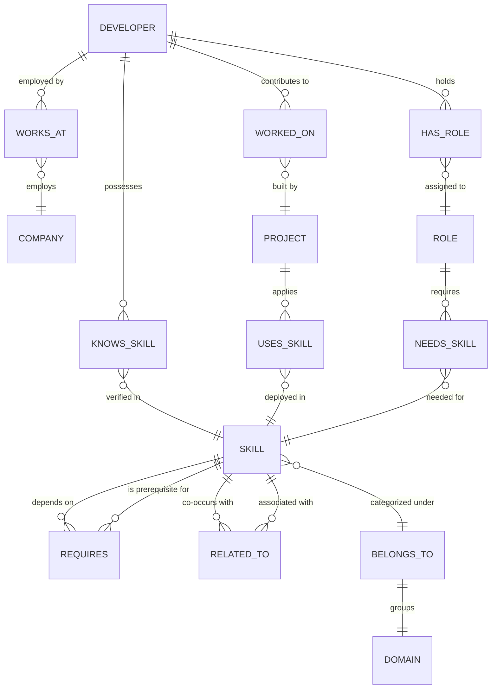
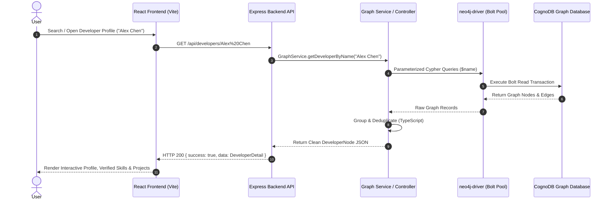

# 🚀 SkillGraph: Graph-Powered Developer Knowledge & Career Path Navigator

[](https://wexa.ai)
[-2563eb.svg)](https://neo4j.com/docs/bolt/current/bolt/)
[](https://expressjs.com)
[](https://react.dev)
[](LICENSE)

> Built for the **Wexa AI CognoDB Graph Database Take-Home Assignment**.

---

## 📌 Table of Contents

1. [Project Overview](#-1-project-overview)
2. [The Problem SkillGraph Solves](#-2-the-problem-skillgraph-solves)
3. [How the Application Works](#-3-how-the-application-works)
4. [Why a Graph Database (CognoDB vs Relational SQL)?](#-4-why-a-graph-database-cognodb-vs-relational-sql)
5. [Graph Data Model & Architecture](#-5-graph-data-model--architecture)
6. [Multi-Hop Traversal & Awkward SQL Query Comparison](#-6-multi-hop-traversal--awkward-sql-query-comparison)
7. [Technology Stack](#-7-technology-stack)
8. [Project Structure](#-8-project-structure)
9. [Prerequisites & CognoDB Setup](#-9-prerequisites--cognodb-setup)
10. [Environment Variables Setup](#-10-environment-variables-setup)
11. [Installation & Local Run](#-11-installation--local-run)
12. [Database Seeding](#-12-database-seeding)
13. [REST API Reference](#-13-rest-api-reference)
14. [Core Cypher Queries & CognoDB Compatibility](#-14-core-cypher-queries--cognodb-compatibility)
15. [Frontend/Backend Architecture & Request Flow](#-15-frontendbackend-architecture--request-flow)
16. [Error Handling & Reliability](#-16-error-handling--reliability)
17. [Screenshots](#-17-screenshots)
18. [Hosted Demo & Video Walkthrough](#-18-hosted-demo--video-walkthrough)

---

## 📖 1. Project Overview

**SkillGraph** is a full-stack, graph-native developer intelligence and career progression platform. It models real-world software engineering ecosystems — developers, competencies, production projects, enterprise companies, job roles, and multi-tier technology prerequisite hierarchies — as an interconnected property graph inside **CognoDB**.

Through high-performance Cypher pattern matching and multi-hop graph traversals, SkillGraph enables developers, engineering managers, and recruiters to explore connected talent, analyze skill gaps for career mobility, discover related technologies via collaborative co-occurrence, and trace transitive dependency chains in milliseconds.

---

## 🎯 2. The Problem SkillGraph Solves

In modern technical organizations, developer skills and project experiences do not exist in isolated silos:
- **Hidden Prerequisite Blockers:** A developer aiming to learn Next.js or Kubernetes often lacks the foundational chain (e.g., `Next.js -> React -> TypeScript -> JavaScript` or `Kubernetes -> Docker`). Relational tables cannot naturally resolve recursive dependency trees without heavy recursive joins.
- **Surface-Level Competency Matching:** Relational keyword searches only match flat labels, missing lateral affinities (`RELATED_TO`), cross-developer co-occurrence, and production project verification (`WORKED_ON -> Project -> USES_SKILL`).
- **Complex Career Gap Analysis:** Determining what an engineer is missing for a Staff or Lead role requires comparing their acquired competencies against role requirements while computing downstream blockers in a single atomic flow.

SkillGraph solves this by turning developer capabilities and technology prerequisites into an **index-free adjacency graph** in CognoDB.

---

## ⚙️ 3. How the Application Works

1. **Global Graph Search:** Users search by developer name, technology, company, or project name. CognoDB performs unified case-insensitive pattern matching across graph node labels.
2. **Developer Profile & Verification:** Shows verified skills with proficiency levels and production projects where skills were deployed in production.
3. **Collaborative Recommendations (Related Developers):** Computes tripartite graph co-occurrence `(:Developer)-[:KNOWS_SKILL]->(:Skill)<-[:KNOWS_SKILL]-(:Developer)` and ranks overlapping engineers by **Jaccard Similarity Index**.
4. **Multi-Hop Dependency Traversal:** Traverses `(:Developer)-[:WORKED_ON]->(:Project)-[:USES_SKILL]->(:Skill)-[:REQUIRES*1..3]->(:Prerequisite)` to map the transitive knowledge base of any project.
5. **Skill Topology & Ecosystem Exploration:** Explores immediate prerequisites (`[:REQUIRES]`), lateral affinities (`[:RELATED_TO]`), and talent density per skill.
6. **Career Gap & Roadmap Analysis:** Compares acquired developer skills against target role profiles to uncover unfulfilled prerequisites and prioritize learning paths.

---

## ⚡ 4. Why a Graph Database (CognoDB vs Relational SQL)?

| Evaluation Dimension | Relational Database (PostgreSQL / MySQL) | Graph Database (CognoDB) |
| :--- | :--- | :--- |
| **Recursive Prerequisite Trees** | Requires complex recursive Common Table Expressions (`WITH RECURSIVE`). Execution degrades exponentially as dependency depth increases due to repeated index lookups and self-joins. | **Index-Free Adjacency:** Direct pointer dereferencing traverses arbitrary depth in O(1) per hop: `MATCH path = (s:Skill)-[:REQUIRES*1..3]->(p:Skill)`. |
| **Career Gap & Blocker Detection** | Requires 4-to-6-way joins across `developers`, `dev_skills`, `roles`, `role_skills`, and recursive `prerequisites`, leading to high memory overhead. | **Declarative Graph Pattern Matching:** Evaluates developer competencies against role requirements and unfulfilled downstream dependencies in a single concise query. |
| **Collaborative Tech Recommendations** | Heavy self-joins with multiple `GROUP BY` aggregations across relational junction tables. | **Tripartite Graph Traversal:** Natural path `(:Skill)<-[:KNOWS_SKILL]-(dev)-[:KNOWS_SKILL]->(:Skill)` surfaces high-affinity technologies instantly. |
| **Schema Evolution & Flexibility** | Adding new relationship types (`MENTORS`, `COMPATIBLE_WITH`, `DEPRECATED_BY`) requires schema migrations, foreign keys, and junction tables. | **Dynamic Property Graph:** Relationships are first-class citizens. New edge types and properties can be added dynamically with zero schema migration downtime. |

---

## 📊 5. Graph Data Model & Architecture

### Node Labels
- **`Developer`**: `{ name: String, email: String, experienceYears: Integer, bio: String, avatar: String }`
- **`Skill`**: `{ name: String, category: String, difficulty: String, description: String, popularity: Integer }`
- **`Project`**: `{ name: String, description: String, status: String }`
- **`Company`**: `{ name: String, industry: String, location: String }`
- **`Role` / `JobRole`**: `{ title: String, department: String, level: String, targetLevel: String }`
- **`Domain`**: `{ id: String, name: String, description: String, color: String }`

### Relationship Types
- **`(:Developer)-[:WORKS_AT]->(:Company)`**: Employment relationship.
- **`(:Developer)-[:HAS_ROLE]->(:Role)`**: Assigned organizational role.
- **`(:Developer)-[:KNOWS_SKILL { proficiency: String, yearsOfExperience: Integer }]->(:Skill)`**: Acquired skill competency.
- **`(:Developer)-[:WORKED_ON { role: String }]->(:Project)`**: Production project contribution.
- **`(:Project)-[:USES_SKILL]->(:Skill)`**: Technology stack deployed in project.
- **`(:Skill)-[:REQUIRES { isMandatory: Boolean, weight: Float }]->(:Skill)`**: Directed prerequisite dependency.
- **`(:Skill)-[:RELATED_TO { strength: Float }]->(:Skill)`**: Lateral technology affinity.
- **`(:Skill)-[:BELONGS_TO]->(:Domain)`**: Taxonomy domain grouping.
- **`(:Role)-[:NEEDS_SKILL { importance: String }]->(:Skill)`**: Job role skill requirement.

### Mermaid Data Model Diagram



---

## 🔬 6. Multi-Hop Traversal & Awkward SQL Query Comparison

### Multi-Hop Traversal in SkillGraph
In `GraphService.getDeveloperProjectSkillsTraversal()`, SkillGraph executes a **3-tier multi-hop path**:
```
(:Developer) -> [:WORKED_ON] -> (:Project) -> [:USES_SKILL] -> (:Skill) -> [:REQUIRES*1..3] -> (:Prerequisite)
```
This traversal discovers not only what technologies an engineer used in production, but recursively resolves every foundational prerequisite up to 3 hops deep.

### Relational SQL vs CognoDB Cypher Comparison

#### CognoDB Cypher (Concise, Graph-Native):
```cypher
MATCH (d:Developer {name: $name})-[wo:WORKED_ON]->(p:Project)-[:USES_SKILL]->(s:Skill)
OPTIONAL MATCH (s)-[:REQUIRES*1..3]->(prereq:Skill)
RETURN d.name AS developer, p.name AS project, wo.role AS role, s.name AS skill, prereq.name AS prereq;
```

#### Equivalent Relational SQL (Awkward, Multi-Join CTE):
```sql
WITH RECURSIVE PrerequisiteChain AS (
    -- Anchor member: direct prerequisites
    SELECT sp.skill_id, sp.prerequisite_id, 1 AS depth
    FROM skill_prerequisites sp
    UNION ALL
    -- Recursive member: transitive prerequisites up to 3 hops
    SELECT pc.skill_id, sp.prerequisite_id, pc.depth + 1
    FROM PrerequisiteChain pc
    JOIN skill_prerequisites sp ON pc.prerequisite_id = sp.skill_id
    WHERE pc.depth < 3
)
SELECT 
    d.name AS developer,
    p.name AS project,
    wo.role AS role,
    s.name AS skill,
    pr.name AS prereq
FROM developers d
JOIN developer_projects wo ON d.id = wo.developer_id
JOIN projects p ON wo.project_id = p.id
JOIN project_skills ps ON p.id = ps.project_id
JOIN skills s ON ps.skill_id = s.id
LEFT JOIN PrerequisiteChain pc ON s.id = pc.skill_id
LEFT JOIN skills pr ON pc.prerequisite_id = pr.id
WHERE LOWER(d.name) = LOWER('Alex Chen');
```
*Why SQL is awkward here:* The relational version requires managing 5 junction tables, creating a recursive CTE table, tracking recursion depth bounds, and executing multiple join scans that scale poorly as the graph grows.

---

## 🛠️ 7. Technology Stack

- **Database:** [CognoDB](https://wexa.ai) (Graph Database accessed over official Neo4j Bolt Driver)
- **Database Driver:** `neo4j-driver` (v5.20+) with connection pooling and transactional sessions
- **Backend Framework:** Node.js (v18+) with Express, TypeScript (v5.4+), Helmet, CORS, Morgan
- **Frontend Framework:** React 18 with TypeScript, Vite (v5.4+), Tailwind CSS (v3.4+)
- **Icons & Visuals:** Lucide React
- **Monorepo Tooling:** Concurrently, tsx (TypeScript execute runtime)

---

## 📂 8. Project Structure

```
SkillGraph/
├── .env.example                 # Root environment variables template
├── .gitignore                   # Monorepo gitignore (secrets, node_modules, dist)
├── package.json                 # Monorepo scripts (dev, build, seed, install:all)
├── README.md                    # Project documentation
│
├── server/                      # Express + TypeScript Backend
│   ├── src/
│   │   ├── config/
│   │   │   └── database.ts      # CognoDB Bolt driver singleton & health check
│   │   ├── controllers/
│   │   │   ├── analysisController.ts   # Skill gap analysis handler
│   │   │   ├── developerController.ts  # Developer lookup, search, related devs
│   │   │   ├── graphController.ts      # Subgraph overview & domain taxonomy
│   │   │   ├── healthController.ts     # CognoDB connection verification
│   │   │   ├── roleController.ts       # Job roles & required skill queries
│   │   │   ├── searchController.ts     # Global multi-entity fuzzy search
│   │   │   └── skillController.ts      # Skill metadata & developer talent
│   │   ├── middleware/
│   │   │   └── errorHandler.ts  # Centralized API error response handler
│   │   ├── queries/
│   │   │   └── cypherQueries.ts # Centralized, CognoDB-compatible Cypher queries
│   │   ├── routes/
│   │   │   ├── analysisRoutes.ts
│   │   │   ├── developerRoutes.ts
│   │   │   ├── graphRoutes.ts
│   │   │   ├── healthRoutes.ts
│   │   │   ├── index.ts         # Central API route mounter
│   │   │   ├── roleRoutes.ts
│   │   │   ├── searchRoutes.ts
│   │   │   ├── seedRoutes.ts
│   │   │   └── skillRoutes.ts
│   │   ├── seed/
│   │   │   ├── seedData.json    # Graph dataset
│   │   │   └── seedRunner.ts    # Idempotent database seeder
│   │   ├── services/
│   │   │   ├── graphService.ts  # Core business logic & graph traversals
│   │   │   └── seedService.ts   # Full graph seeder service
│   │   ├── types/
│   │   │   └── index.ts         # Backend TypeScript data interfaces
│   │   └── index.ts             # Express server entry point
│   ├── .env.example
│   ├── package.json
│   └── tsconfig.json
│
└── client/                      # React 18 + Vite Frontend
    ├── src/
    │   ├── api/
    │   │   └── client.ts        # Typed API client with error handling
    │   ├── components/
    │   │   ├── cards/           # DeveloperCard, ProjectCard, CompanyCard
    │   │   ├── common/          # SearchBar, SkillBadge, Loading, Empty, Error
    │   │   └── layout/          # Navbar (with live DB pill), Footer
    │   ├── pages/
    │   │   ├── DeveloperDetailPage.tsx # Verified skills, projects, related devs
    │   │   ├── HomePage.tsx            # Global graph search & filtered cards
    │   │   └── SkillDetailPage.tsx     # Skill topology, prereqs, verified talent
    │   ├── types/
    │   │   └── index.ts         # Frontend TypeScript interfaces
    │   ├── App.tsx              # React router layout
    │   ├── main.tsx             # Vite entry point
    │   └── index.css            # Tailwind CSS styling
    ├── .env.example
    ├── package.json
    ├── vite.config.ts
    └── tailwind.config.js
```

---

## 🔌 9. Prerequisites & CognoDB Setup

### Prerequisites
- **Node.js**: v18.0.0 or higher (v20+ recommended)
- **npm**: v9+ or **pnpm**
- **CognoDB Cloud or Local Instance**: Access to a CognoDB Bolt endpoint.

### Step-by-Step CognoDB Setup
1. Obtain your CognoDB credentials:
   - **URI:** `bolt+s://<your-subdomain>.databases.cognodb.com` (or local `bolt://localhost:7687`)
   - **Username:** `cognodb`
   - **Password:** `<your_password>`
2. The official Neo4j Bolt driver connects securely over TLS/SSL using these credentials.

---

## 🔑 10. Environment Variables Setup

Copy the environment template in both root and server directories:

```bash
# From the project root
cp .env.example .env
cp server/.env.example server/.env
cp client/.env.example client/.env
```

### Configuration Parameters:
```ini
# CognoDB Graph Database Connection
COGNODB_URI=bolt+s://db-b92bcb51.bravo.databases.cognodb.com
COGNODB_USERNAME=cognodb
COGNODB_PASSWORD=your_password_here

# Backend Server Configuration
PORT=5000
NODE_ENV=development
FRONTEND_URL=http://localhost:5173

# Frontend Client Configuration
VITE_API_URL=http://localhost:5000/api
```

---

## 💻 11. Installation & Local Run

### Option A: Monorepo Single-Command (Recommended)

1. **Install all dependencies:**
   ```bash
   npm run install:all
   ```

2. **Seed CognoDB database:**
   ```bash
   npm run seed
   ```

3. **Start both backend and frontend concurrently:**
   ```bash
   npm run dev
   ```
   - **Frontend:** [http://localhost:5173](http://localhost:5173)
   - **Backend API:** [http://localhost:5000](http://localhost:5000)

### Option B: Separate Terminal Processes

```bash
# Terminal 1: Backend
cd server
npm install
npm run seed
npm run dev

# Terminal 2: Frontend
cd client
npm install
npm run dev
```

---

## 🌱 12. Database Seeding

The seed script idempotently initializes unique constraints, clears demo sample nodes, and inserts the complete property graph dataset:

```bash
cd server
npm run seed
```

### Seed Statistics Created:
- **Developers (5):** Alex Chen, Priya Sharma, Marcus Vance, Elena Rostova, David Kim
- **Skills (15):** JavaScript, TypeScript, React, Next.js, Tailwind CSS, Node.js, Python, PostgreSQL, Graph Databases & Cypher, Redis, Docker, Kubernetes, Terraform, PyTorch, LLMs & Graph RAG
- **Companies (4):** Wexa AI, CloudScale Systems, DevForge Labs, NeuralGraph Inc
- **Job Roles (5):** Lead Full-Stack Architect, Senior Backend Specialist, Cloud Platform & DevOps Engineer, AI & Graph RAG Engineer, Frontend Systems Engineer
- **Projects (4):** Real-Time Graph Visualizer, Distributed Microservices Engine, Cloud Infrastructure Pipeline, Multi-Agent Graph RAG System
- **Edges (50+):** `REQUIRES`, `RELATED_TO`, `KNOWS_SKILL`, `WORKED_ON`, `USES_SKILL`, `WORKS_AT`, `HAS_ROLE`, `HIRES_ROLE`

---

## 📡 13. REST API Reference

| HTTP Method | Route | Description | Query / Path Parameters |
| :--- | :--- | :--- | :--- |
| `GET` | `/api/health` | CognoDB connection status and agent metadata | None |
| `POST` | `/api/seed` | Trigger database reset and seeding | None |
| `GET` | `/api/search` | Fuzzy multi-entity search (Developers, Skills, Projects, Companies) | `?q=:searchTerm` |
| `GET` | `/api/developers` | List all developer profiles and acquired skills | None |
| `GET` | `/api/developers/:name` | Full developer profile, skills, and projects | `:name` |
| `GET` | `/api/developers/:name/related` | Related developers ranked by Jaccard similarity index | `:name` |
| `GET` | `/api/developers/:name/project-skills` | Multi-hop traversal (`Dev -> Project -> Skills -> Prereqs`) | `:name` |
| `GET` | `/api/skills` | List all skills with difficulty and taxonomy domain | None |
| `GET` | `/api/skills/:name` | Skill details, direct prerequisites, and lateral relations | `:name` |
| `GET` | `/api/skills/:name/developers` | Developers proficient in or applying this skill | `:name` |
| `GET` | `/api/graph/overview` | Full graph nodes and edges for visualizer | `?domain=:domainId` |
| `GET` | `/api/graph/domains` | List all domain groupings and color mappings | None |
| `GET` | `/api/roles` | List all job roles with needed skill profiles | None |
| `GET` | `/api/roles/:id` | Get job role requirements by title or ID | `:id` |
| `GET` | `/api/analysis/gap` | Calculate skill gap and prerequisite blockers | `?developerId=...&roleId=...` |

---

## ⚡ 14. Core Cypher Queries & CognoDB Compatibility

> **CognoDB Compatibility Note:** CognoDB's Bolt implementation does not support the Neo4j Cypher `collect()` aggregation function. All queries in SkillGraph are designed to return flat graph rows, with array aggregation, deduplication, and similarity indexing handled in TypeScript.

### 1. Developer Profile Query
```cypher
MATCH (d:Developer)
WHERE toLower(d.name) = toLower($name)
OPTIONAL MATCH (d)-[:WORKS_AT]->(c:Company)
OPTIONAL MATCH (d)-[:HAS_ROLE]->(r:Role)
RETURN d.name AS name, d.email AS email, d.experienceYears AS experienceYears, d.bio AS bio, c.name AS company, r.title AS role
LIMIT 1;
```

### 2. Multi-Hop Project Skill Dependency Traversal
```cypher
MATCH (d:Developer)
WHERE toLower(d.name) = toLower($name)
MATCH (d)-[wo:WORKED_ON]->(p:Project)-[:USES_SKILL]->(s:Skill)
OPTIONAL MATCH (s)-[:REQUIRES*1..3]->(prereq:Skill)
RETURN d.name AS developerName, p.name AS projectName, wo.role AS roleOnProject, s.name AS skillName, s.category AS skillCategory, s.difficulty AS skillDifficulty, prereq.name AS prereqName;
```

### 3. Collaborative Recommendation Traversal (Tripartite Co-occurrence)
```cypher
MATCH (target:Developer)-[:KNOWS_SKILL]->(s:Skill)<-[:KNOWS_SKILL]-(other:Developer)
WHERE toLower(target.name) = toLower($name) AND other <> target
OPTIONAL MATCH (other)-[:WORKS_AT]->(c:Company)
OPTIONAL MATCH (other)-[:HAS_ROLE]->(r:Role)
RETURN other.name AS developerName, c.name AS company, r.title AS role, s.name AS skillName;
```
*TypeScript processes the intersection and union of skills to compute the exact **Jaccard Similarity Coefficient**:*
$$\text{Jaccard Similarity} = \frac{|S_{\text{target}} \cap S_{\text{other}}|}{|S_{\text{target}} \cup S_{\text{other}}|}$$

---

## 🏛️ 15. Frontend/Backend Architecture & Request Flow



---

## 🛡️ 16. Error Handling & Reliability

- **Parameterization:** 100% of Cypher queries use `$param` object binding to eliminate Cypher injection vulnerabilities.
- **Graceful Error Responses:** Standardized `{ success: false, error: string }` JSON format with appropriate HTTP status codes (`400 Bad Request`, `404 Not Found`, `500 Server Error`).
- **Connection Diagnostics:** `/api/health` polls CognoDB over Bolt and reports connectivity and agent version.
- **UI Resilience:** Loading skeletons, empty states with one-click suggestions, and retryable error cards prevent UI crashes.

---

## 📸 17. Screenshots

### 1. Global Graph Search & Multi-Entity Exploration

*Figure 1: Global multi-entity search across Developers, Skills, Projects, and Companies.*

### 2. Developer Profile & Verified Production Skills

*Figure 2: Developer view showing verified competencies, production project deployments, and multi-hop prerequisites.*

### 3. Collaborative Graph: Related Developers (Jaccard Similarity)

*Figure 3: Related developers ranked by skill overlap and Jaccard similarity index.*

### 4. Skill Topology & Ecosystem Prerequisites

*Figure 4: Skill detail page detailing direct prerequisites (`[:REQUIRES]`), related skills (`[:RELATED_TO]`), and talent density.*

---

## 🌐 18. Hosted Demo & Video Walkthrough

- **Live Hosted Application:** [https://skillgraph-demo.onrender.com]([https://skillgraph-demo.onrender.com](https://skill-graph-rho-eight.vercel.app/skills/Node.js)) *(Insert deployed URL)*
- **Interactive Backend API:** [https://skillgraph-api.onrender.com](https://skillgraph-api.onrender.com) *(Insert deployed API URL)*
- **Loom / YouTube Video Walkthrough:** [https://www.youtube.com/watch?v=placeholder](https://www.youtube.com/watch?v=placeholder) *(Insert 3-5 min video recording)*

---

## 📄 19. License

This project is open source and available under the [MIT License](LICENSE).
